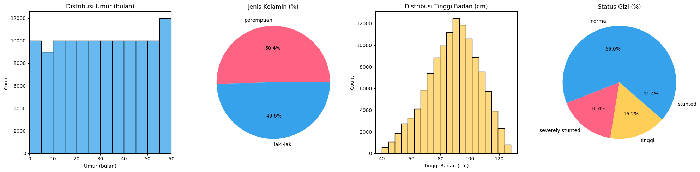
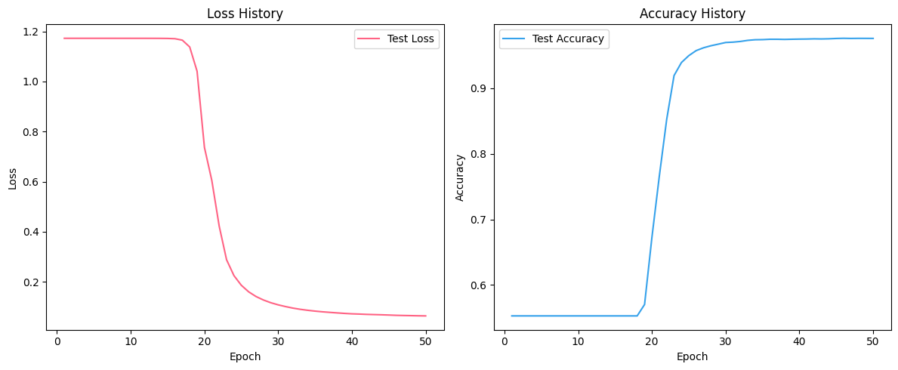

# Stunting Detection with Backpropagation

Aplikasi deteksi stunting (status gizi balita) berbasis AI menggunakan metode backpropagation neural network. Dilengkapi dengan antarmuka Streamlit untuk prediksi interaktif berdasarkan data **umur**, **jenis kelamin**, dan **tinggi badan** balita.

---

## Tentang Proyek

Proyek ini bertujuan untuk membantu tenaga kesehatan, peneliti, dan masyarakat dalam melakukan prediksi status gizi balita menggunakan kecerdasan buatan. Model yang digunakan adalah neural network dengan algoritma backpropagation. Prediksi dilakukan berdasarkan umur (bulan), jenis kelamin, dan tinggi badan balita.

Aplikasi ini berjalan secara interaktif menggunakan Streamlit, sehingga mudah digunakan langsung di [web](https://stunting-detection-backpropagationgit.streamlit.app/) lokal.

---

## Fitur

- Prediksi status gizi balita: **Normal**, **Stunted**, **Severely Stunted**, **Tinggi**.
- Input data interaktif: umur, jenis kelamin, dan tinggi badan.
- Validasi input otomatis sesuai rentang data.
- Visualisasi hasil prediksi secara real-time.
- Implementasi model backpropagation dengan Python dan NumPy.

---

## Dataset

Dataset yang digunakan dapat diunduh dari:
https://www.kaggle.com/datasets/rendiputra/stunting-balita-detection-121k-rows

---



---

## Instalasi

### 1. Clone repositori

```bash
git clone https://github.com/riyanfazrirahman-kampus/stunting-detection-backpropagation.git
cd stunting-detection-backpropagation
```

### 2. Install dependencies

Disarankan menggunakan `virtualenv` atau `venv`.

```bash
pip install -r requirements.txt
```

**Dependencies utama:**

- numpy
- pandas
- scikit-learn
- matplotlib
- seaborn
- xgboost
- joblib
- streamlit
- Pillow

---

## Penggunaan

### Menjalankan aplikasi Streamlit

```bash
streamlit run streamlit_app.py
```

Akses aplikasi di browser pada `http://localhost:8501`.

### Input Data

- **Umur:** 0 - 60 bulan
- **Jenis Kelamin:** Laki-laki / Perempuan
- **Tinggi Badan:** 0 - 127.9 cm

Klik **Prediksi Sekarang** untuk mendapatkan hasil status gizi.

### Notebook Analisis

Untuk eksperimen dan analisis manual, jalankan notebook:

```bash
jupyter notebook predict_stunted.ipynb
```

---

## Struktur Proyek

```
stunting-detection-backpropagation/
├── data/
│   └── baby.png                # Gambar ilustrasi
├── model/
│   ├── stunted_model.npz       # File bobot model
│   └── scaler.joblib           # File scaler normalisasi
├── predict_stunted.ipynb       # Notebook analisis & training
├── streamlit_app.py            # Aplikasi Streamlit
├── requirements.txt            # Daftar dependencies
└── README.md                   # Dokumentasi (ini)
```

## Highlight Proses Backpropagation (Feedforward Neural Network)

### 1. Forward Pass (Propagasi Maju)

```python
def forward_pass(X, W1, b1, W2, b2, W3, b3):
    Z1 = np.dot(X, W1) + b1
    A1 = np.tanh(Z1)
    Z2 = np.dot(A1, W2) + b2
    A2 = np.tanh(Z2)
    Z3 = np.dot(A2, W3) + b3
    A3 = np.exp(Z3) / np.sum(np.exp(Z3), axis=1, keepdims=True)  # Softmax
    return Z1, A1, Z2, A2, Z3, A3
```

### 2. Prediksi Output (Menggunakan hasil forward pass)

```python
def predict_interactive(W1, b1, W2, b2, W3, b3, status_gizi_classes, max_umur, max_tinggi, umur, jenis_kelamin, tinggi_badan):
    user_input = process_user_input(umur, jenis_kelamin, tinggi_badan, max_umur, max_tinggi)
    _, _, _, _, _, A3 = forward_pass(user_input, W1, b1, W2, b2, W3, b3)
    predicted_class = status_gizi_classes[np.argmax(A3)]
    return predicted_class
```

## 3. Contoh Pseudocode Training Backpropagation (Backward Pass + Update Weights)

Berikut adalah contoh generik training dengan algoritma backpropagation pada Multilayer Perceptron (MLP). Contoh ini menunjukkan langkah-langkah utama: forward pass, error calculation, backward pass, dan update weights.

```python
# X: input batch, y: target label (one-hot)
# W1, b1, W2, b2, W3, b3: bobot dan bias layer 1, 2, dan 3
# learning_rate: laju pembelajaran

for epoch in range(num_epochs):
    # --- Forward Pass ---
    Z1 = np.dot(X, W1) + b1
    A1 = np.tanh(Z1)
    Z2 = np.dot(A1, W2) + b2
    A2 = np.tanh(Z2)
    Z3 = np.dot(A2, W3) + b3
    A3 = softmax(Z3)  # Output

    # --- Error Calculation ---
    loss = cross_entropy(A3, y)  # Loss function

    # --- Backward Pass ---
    dZ3 = A3 - y                     # Output layer error
    dW3 = np.dot(A2.T, dZ3)
    db3 = np.sum(dZ3, axis=0, keepdims=True)

    dA2 = np.dot(dZ3, W3.T)
    dZ2 = dA2 * (1 - np.power(A2, 2))  # turunan tanh
    dW2 = np.dot(A1.T, dZ2)
    db2 = np.sum(dZ2, axis=0, keepdims=True)

    dA1 = np.dot(dZ2, W2.T)
    dZ1 = dA1 * (1 - np.power(A1, 2))
    dW1 = np.dot(X.T, dZ1)
    db1 = np.sum(dZ1, axis=0, keepdims=True)

    # --- Update Weights ---
    W3 -= learning_rate * dW3
    b3 -= learning_rate * db3
    W2 -= learning_rate * dW2
    b2 -= learning_rate * db2
    W1 -= learning_rate * dW1
    b1 -= learning_rate * db1
```

**Keterangan Singkat:**

- **Forward Pass:** propagasi input ke output.
- **Error Calculation:** hitung loss (misal, cross-entropy).
- **Backward Pass:** hitung gradien error dari output ke input (propagasi balik).
- **Update Weights:** update bobot & bias menggunakan gradien dan learning rate.

---

## 

## Kontribusi

Kontribusi sangat terbuka! Silakan lakukan fork, buat branch baru, dan ajukan pull request.

1. Fork repositori ini
2. Buat branch fitur/bug (`git checkout -b fitur-anda`)
3. Commit perubahan Anda (`git commit -am 'Tambah fitur A'`)
4. Push ke branch (`git push origin fitur-anda`)
5. Buat Pull Request

---

## Catatan Penting

- Pastikan data yang dimasukkan sesuai rentang yang ditentukan.
- Model dan scaler harus sudah tersedia di folder `model/`. Silakan lakukan training ulang jika ingin menggunakan dataset berbeda.
- Untuk penggunaan di luar riset, pastikan proses validasi dan uji model dilakukan dengan data terbaru.

---

# Anggota Kelompok

| Status   | Name                | NIM           | University          | Media                                                                       | GitHub                                        |
| -------- | ------------------- | ------------- | ------------------- | --------------------------------------------------------------------------- | --------------------------------------------- |
| `Active` | Riyan Fazri Rahman  | `C2255201005` | STMIK Palangka Raya | [LinkedIn](https://www.linkedin.com/in/riyan-fazri-rahman/)                 | [GitHub](https://github.com/riyanfazrirahman) |
| `Active` | Alif Rahmatullah L. | `C2255201029` | STMIK Palangka Raya | [LinkedIn](https://www.linkedin.com/in/alif-rahmatullah-lesmana-565028311/) | [GitHub](https://github.com/Peparrepair)      |
| `Active` | Rif'ad Amin Jayadi  | `C2255201018` | STMIK Palangka Raya | -                                                                           | [GitHub](https://github.com/)                 |
| `Active` | Oga Luisca MIka S.  | `C2255201016` | STMIK Palangka Raya | -                                                                           | [GitHub](https://github.com/)                 |

---
